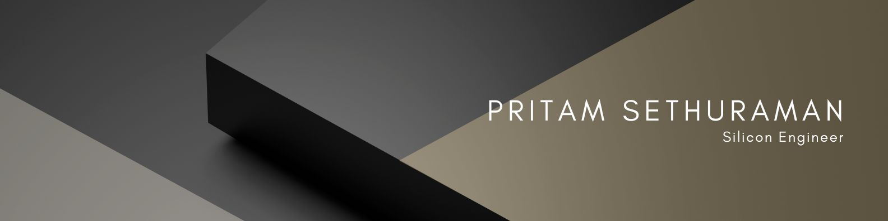

<!--
**Pritam-Sethuraman/Pritam-Sethuraman** is a ✨ _special_ ✨ repository because its `README.md` (this file) appears on your GitHub profile.
-->

# Hi there 👋

## 💫 About Me:
🔭 I'm Pritam, a Silicon Analyst at Accenture 
🌱 My key interests are in ASIC Design and Verification 
💻 I'm proficient in VHDL, SystemVerilog, UVM, etc. 
👯 I’m looking to collaborate on projects related to ASIC design and verification 
💬 Ask me about anything related to ASIC Design and Verification 

## 🌐 Socials:
 

## 💻 Tech Stack:

---

</a>
 

